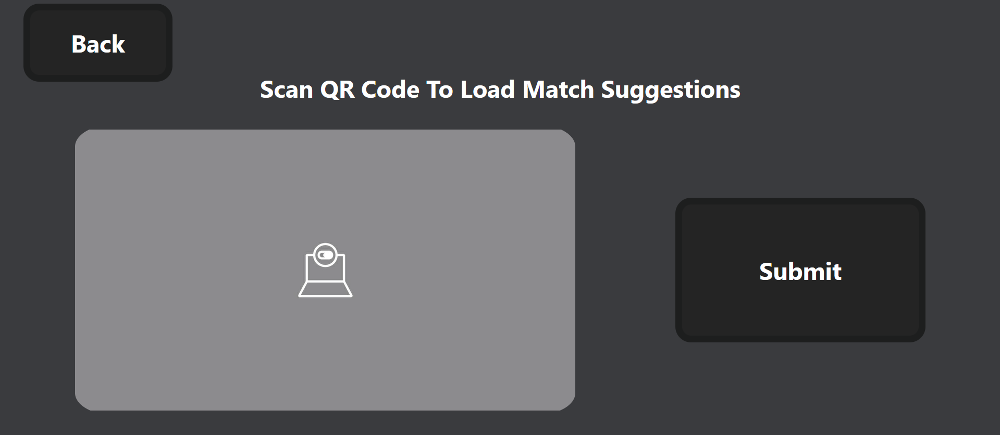
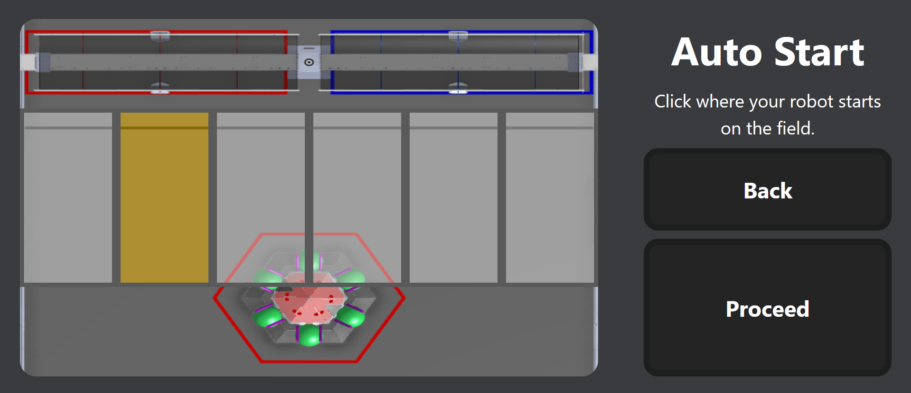
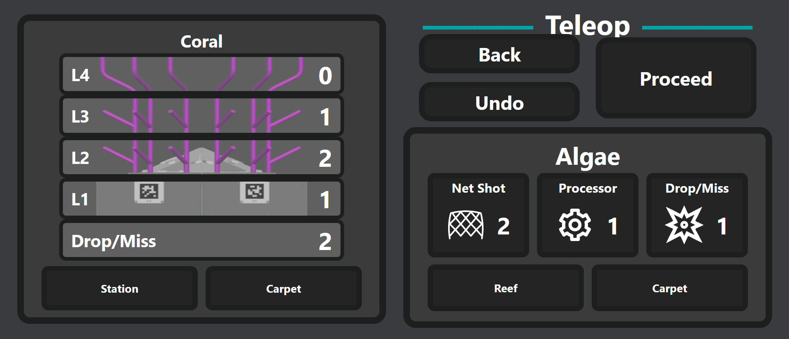
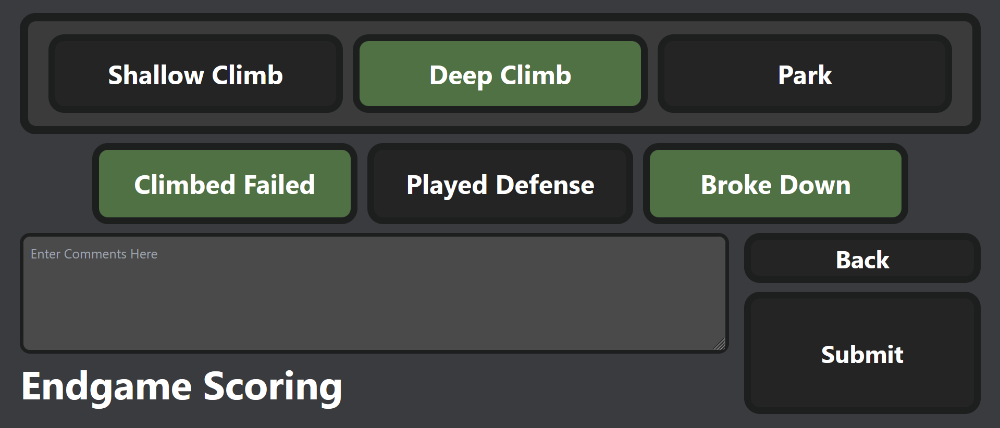

# VScouter: FRC Scouting Revolutionized

## Introduction

VScouter is a versatile scouting application designed for FRC (FIRST Robotics Competition) teams. It simplifies the data collection process for scouting teams during competitions, providing a robust and efficient platform to gather, analyze, and store performance metrics of competing robots.

## Features

- Data collection though a [website](https://vscouter.netlify.app/)
- Website can be ran offline in environments with no internet
- Auto completion for teams to scout on scouting website
- Visual and intuitive buttons and pictures to help scout real-time
- USB flash drive data collection process

## Usage

### Using The Website

1. Visit [https://vscouter.netlify.app/](https://vscouter.netlify.app/)
2. **Main Page:** When the scouter loads into the app there are 4 main buttons. The `Full Screen` button makes the website go into full screen mode. The `Dump Data` button will download a JSON file of the scouting data. See [Collecting Data](#collecting-data) for more info. The `Start Scouting` button continues to the game start scouting page.
   
3. **Settings Page:** Has various buttons for debugging and for loading auto match suggestions. `Get Match Data` redirects to the page for getting the auto match suggestions. See [Auto Completion Match Data](#auto-completion-match-data) for more info. `Clear Match Data` clears the auto match suggestions. `Clear Scouting Data` clears the scouting data that is saved on the device. `View Scouting Data` opens a page where the user is able to see the JSON version of the scouting data for debugging. The `Parse Data` button brings the user to the parse data page. See [Parsing Data](#parsing-data) for more info.
   
4. **Match Data:** Here the scouter can scan a QR code leading to the generated match data for the auto competition. See more at [Using](#using) of [Auto Completion Match Data](#auto-completion-match-data).
   
5. **Game Start:** The `Select Alliance` component allows the scouter to select the alliance they are scouting. The `Match Number` component allows the scouter to enter the match they are scouting. The `Scouting Initials` component allows the scouter to enter their initials. The `Select Team` component shows auto completion buttons that are based on the alliance and match that the scouter inputted previously. Additionally, the scouter may choose to select a different team than auto suggested. The button/input that is darker than the other is what is selected. The scouter may choose to click the `Back` Button to return to the past page. To advance to the next page, the scouter can click the `Proceed` button.
   
6. **Auto Start:** The scouter can enter where the robot generally starts. They may do this by clicking each zone on the map. The scouter may choose to click the `Back` Button to return to the past page. To advance to the next page, the scouter can click the `Proceed` button.
   
7. **Auto Scoring:** The page is separated into two main sections: coral and algae. In the coral section there is a side view of the reef separated into the levels of it: L1, L2, L3, L4, and Drop/Missed. Then there is a set of all the places you can pick a coral up in auto: the station, mark 1, mark 2, and mark 3. The roadmap of the user's input is selected where they got a coral and then where they placed it. In the algae section, the user may select where they picked up an algae (the reef, mark 1, mark 2, and mark 3) and where they placed it (net shot, processor, and drop/miss). The `Passed Starting Line` button automatically selects if the scouter selects any other action. The `Proceed` button starts blinking after 15 seconds to remind the scouter to switch pages. 
   | Keybind | Button                |
   |---------|-----------------------|
   | `       | Drop Miss Coral       |
   | 1       | Place Coral L1        |
   | 2       | Place Coral L2        |
   | 3       | Place Coral L3        |
   | 4       | Place Coral L4        |
   | q       | Pick Coral Station    |
   | w       | Pick Coral Mark 1     |
   | e       | Pick Coral Mark 2     |
   | r       | Pick Coral Mark 3     |
   | 9       | Place Algae Net Shot  |
   | 0       | Place Algae Processor |
   | -       | Drop Miss Algae       |
   | u       | Pick Algae Reef       |
   | i       | Pick Algae Mark 1     |
   | o       | Pick Algae Mark 2     |
   | p       | Pick Algae Mark 3     |
   
8. **Teleop Scoring:** This page is similar to the auto scoring page. The page is separated into two main sections: coral and algae. In the coral section there is a side view of the reef separated into the levels of it: L1, L2, L3, L4, and Drop/Missed. Then there is a set of all the places you can pick a coral up in auto: the station and the carpet. The roadmap of the user's input is selected where they got a coral and then where they placed it. In the algae section, the user may select where they picked up an algae (the reef and carpet) and where they placed it (net shot, processor, and drop/miss).
   | Keybind | Button                |
   |---------|-----------------------|
   | `       | Drop Miss Coral       |
   | 1       | Place Coral L1        |
   | 2       | Place Coral L2        |
   | 3       | Place Coral L3        |
   | 4       | Place Coral L4        |
   | q       | Pick Coral Station    |
   | w       | Pick Coral Carpet     |
   | 9       | Place Algae Net Shot  |
   | 0       | Place Algae Processor |
   | -       | Drop Miss Algae       |
   | u       | Pick Algae Reef       |
   | i       | Pick Algae Carpet     |
   
9. **Endgame Scoring:** The `Shallow Climb`, `Deep Climb`, and `Park` buttons represent what the robot can do on the barge. Then there are toggles for if the robots climb failed, it played defense, and it if it broke down. The `Comments` textbox allows for the scouter to write any additional information such as if they broke down or got penalties.
   

### Collecting Data

1. To collect the data that the scouters have collected, collect a USB flash drive to the devices and click the `Dump Data` button on the home screen. This will download a JSON file of the scouting data. Move this and repeat for each of the scouting devices.
   
2. You may want to delete the scouting data off of the device when done taking the data. This can be done by clicking the `Settings` button and then the `Clear Scouting Data` button.
   

### Parsing Data

1. To get to the parsing data page, click the `Settings` button, and then `Parse Data`.
2. To select the data that was scouted, plug the USB flash drive in with the collected data, click the `Select Files` button, and select all of the JSON data. This will add the files in a list to the right. If a file needs to be removed, the `x` button can be clicked next to the file names.
3. To combine this data into a CSV format, click the `Compile and Download` button. This will download a CSV file with the inputted data.
4. Feed this CSV file into the data analysis software.
   

### Analysis

Analysis is done through Power BI. You can download it for free [here](https://www.microsoft.com/en-us/power-platform/products/power-bi/downloads).

1. To analyze the CSV data you downloaded at [Parsing Data](#parsing-data) you must download the [Power BI file in this repository](/analysis/VScouterAnalysis.pbix). Once downloaded, put the `pbix` file into a folder with nothing in it.
2. Next put you CSV file into the same folder as the `pbix` file. Rename it to `VScouterFullData.csv`
3. Open the `pbix` file with Power BI. To use this new data click `Transform Data` and then `dataFolderPath`. On this page change the directory to where the `pbix` file and CSV file are located (ex. `C:\Users\username\Documents\Analysis`). **There should not be a `\` at the end.**
3. Click `Close & Apply`.

#### Pages of Analysis
- **Picklist:** On this page you can order the teams that you have scouted based on how many notes they have scored in the speaker and amp as well as how many notes they have fed. To sort click below the headers on the arrows that pop up.

- **Team Overview:** On this page you can look at the data collected for a specific team. This includes a table with the data as well as a graph showing their points scored over time. To change which team you are looking at, click on the `Filters` button. Then expand the `Select Team` dropdown. You are able to then select the team you want to view off of this drop down.

- **Match Overview:** On this you can see the data collected for a specific match. There is a table for  each alliance showing the data of each team such as speaker notes, amp notes, fed notes, and trap notes. Additionally, there is a table showing if they had climbed or parked on the stage. To change which match you are looking at, click on the `Filters` button. Then expand the `Match Number` dropdown. You are able to then select the match you want to view off of this drop down.

- **Auto Notes Overview:** On this page you can see how frequent a team picks or attempts to pick a note during the autonomous period. They are expressed by pie charts next to each of the notes on the field that can have the percentages representing the vales `Failed Pick/Shot`, `Picked and Shot`, and `Not Picked`. To change which team you are looking at, click on the `Filters` button. Then expand the `Select Team` dropdown. You are able to then select the team you want to view off of this drop down.

- **Scouter Match Numbers:** On this page you can see how many matches a scouter has scouted. This is shown by a graph of each scouter initial and how many matches they have scouted.

### Auto Completion Match Data

#### **Generating**

1. `cd parsing`
2. `python3 GetMatchData.py`
3. Enter your event key (like 2024njdd)
4. Enter your [TBA API](https://www.thebluealliance.com/apidocs) key

This code is used to generate the auto completion data for the scouting app. Once this data is generated it is downloaded into the [data folder](/data/EventMatches.json). To use this on the scouting apps, you must host this online on a GitHub repository. Now that it is hosted online, to make the QR code you can visit a [common QR code generator](https://getsiimple.com/tools/qr-code-generator/). **You need to make the QR code based on the raw data (shown below).**

#### **Using**

To use generated match suggestions:

1. Click the `Settings` button on the home screen.
2. Click `Get Match Data`.
3. Allow use of device camera.
4. Show and scan the generated QR code.
5. Click `Done`.

## Running Locally

To install VScouter, follow these steps:

1. Clone the repository: `git clone https://github.com/VihaanChhabria/VScouter.git`
2. Move into the website directory: `cd website`
3. Install needed dependencies: `npm install`
4. Run the website locally: `npm run dev`

## License

[MIT](https://choosealicense.com/licenses/mit/)

## Support

If you want to use this or need support, email me at `chhabria.vihaan2@gmail.com`.