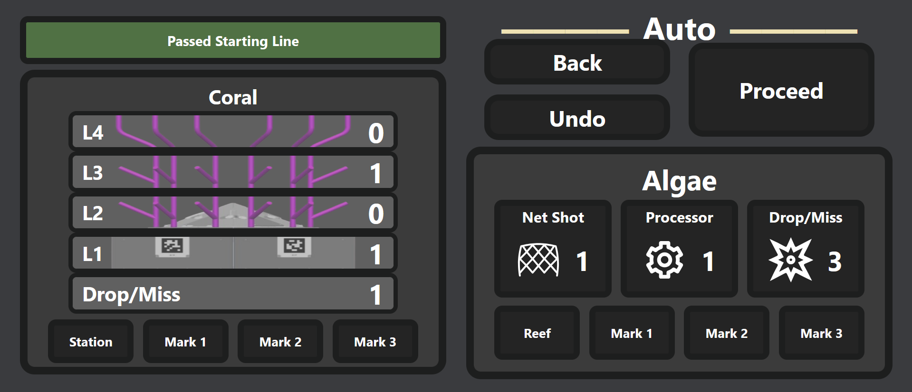

# VScouter: FRC Scouting App

## Introduction

VScouter is a versatile scouting application designed for FRC (FIRST Robotics Competition) teams. It simplifies the data collection process for scouting teams during competitions, providing a robust and efficient platform to gather, analyze, and store performance metrics of competing robots.

## Features

* Data collection though a [website](vscouter.netlify.app/)
* Website can be ran offline in environments with no internet
* Auto completion for teams to scout on scouting website
* Visual and intuitive buttons and pictures to help scout real-time
* Bluetooth server collect data

## Prerequisites

* [Python 3](https://www.python.org/downloads/)
* [Golang](https://go.dev/dl/)
* Linux computer to run Bluetooth server

## Installation

To install VScouter, follow these steps:

1. Clone the repository: `git clone https://github.com/VihaanChhabria/VScouter.git`

## Usage

### Using The Bluetooth Server

To get started with VScouter, follow these steps:

1. `cd server`
2. Run the code of the server: `go run main.go`
3. Enter `r` when wanting to retrieve the scouting data
4. Type `d` to download the retrieved data

### Using The Website

1. Visit [vscouter.netlify.app](vscouter.netlify.app)
2. **Main Page:** When the scouter load into the app there are 4 main buttons. The `Full Screen` buttons makes the website go into full screen mode. The `Connect To Bluetooth` opens up the bluetooth connection popup to connect to the server **(ONLY WORKS ON GOOGLE BROWSERS NOT ON iOS DEVICES)**. The `Game Start` button continues to the game start scouting page.

3. **Settings Page:** Has various buttons for debugging and for loading auto match suggestions. `Get Match Data` redirects to the page for getting the auto match suggestions. `Clear Match Data` clears the auto match suggestions. `Clear Scouting Data` clears the scouting data that is saved on the device. `View Scouting Data` opens a page where the scouter is able to see the JSON version of the scouting data. 

4. **Match Data:** Here the scouter can scan a QR code leading to the generated match data for the auto competition. If the scouter do not want to use a QR code, the scouter may enter the link to the match data manually. If wanting to do this, click `Manual?` as well.

5. **Game Start:** The `Select Alliance` component allows the scouter to select the alliance they are scouting. The `Match Number` component allows the scouter to enter the match they are scouting. The `Scouting Initials` component allows the scouter to enter their initials. The `Select Team` component shows auto completion buttons that are based on the alliance and match that the scouter inputted previously. Additionally, the scouter may choose to select a different team than auto suggested. The button/input that is darker than the other is what is selected. The scouter may choose to click the `Back` Button to return to the past page. To advance to the next page, the scouter can click the `Proceed` button.

6. **Auto Start:** The scouter can enter where the robot generally starts. They may do this by changing the counter's value based on the map. If the robot does not show to the match, the scouter may click the `No Show` button. If the `No Show` button is clicked, the form goes skips other data collection questions. The scouter may choose to click the `Back` Button to return to the past page. To advance to the next page, the scouter can click the `Proceed` button.

7. **Auto Scoring:** The buttons on the screen have the default value `Not Picked`. These can be cycled between `Not Picked`, `Failed Shot`, and `Picked and Shot` by clicking on them. The buttons represent the status for all of the rings in auto. The scouter may choose to click the `Back` Button to return to the past page. To advance to the next page, the scouter can click the `Proceed` button.

8. **Teleop Scoring:** The green buttons represent the ways you can score/do something in teleop. This ranges from from the amp, the speaker, and feeding. The red buttons represent the a mistake in when they tried to score. The `Remove Count` button removes a point from one of the inputs. This is done by the scouter clicking `Remove Count` and then clicking the input that they wanted to decrease. The scouter may choose to click the `Back` Button to return to the past page. To advance to the next page, the scouter can click the `Proceed` button.

9. **Endgame Scoring:** The `Parked`, `Park Failed`, `Climbed`, and `Climb Failed` buttons represent what the robot can do on the stage. The trap made and missed counter represents what the robot can score on the trap. The `Comments` textbox allows for the scouter to write any additional information such as if they broke down or got penalties.

### Using the Parsing Code

#### Generating the Auto Completion Match Data
1. `cd parsing`
2. `python3 GetMatchData.py`
3. Enter your event key
4. Enter your TBA API key

This code is used to generate the auto completion data for the scouting app. Once this data is generated it is downloaded into the [data folder](/data/EventMatches.json). To use this on the scouting apps, you must host this online. I recommend making a GitHub repository with the output file in it. Now that it is hosted online, to make the QR code you can visit a [common QR code generator](https://getsiimple.com/tools/qr-code-generator/). **If you are hosting your file on GitHub, you need to make the QR code based on the raw data (shown below).** 

#### Converting Received Scouting Data Into A CSV File

1. `cd parsing`
2. `python3 ScoutingToCSV.py`

After the server downloads all the data into the [ServerOutputs](/data/ServerOutputs/) folder, it needs to be converted to a CSV file. This is as it combines all the separate JSON files and as Tableau (a data analysis software) only accepts CSV files.

